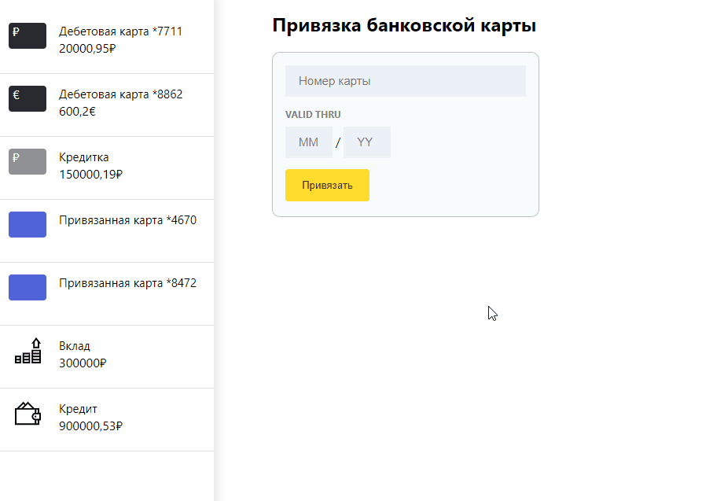
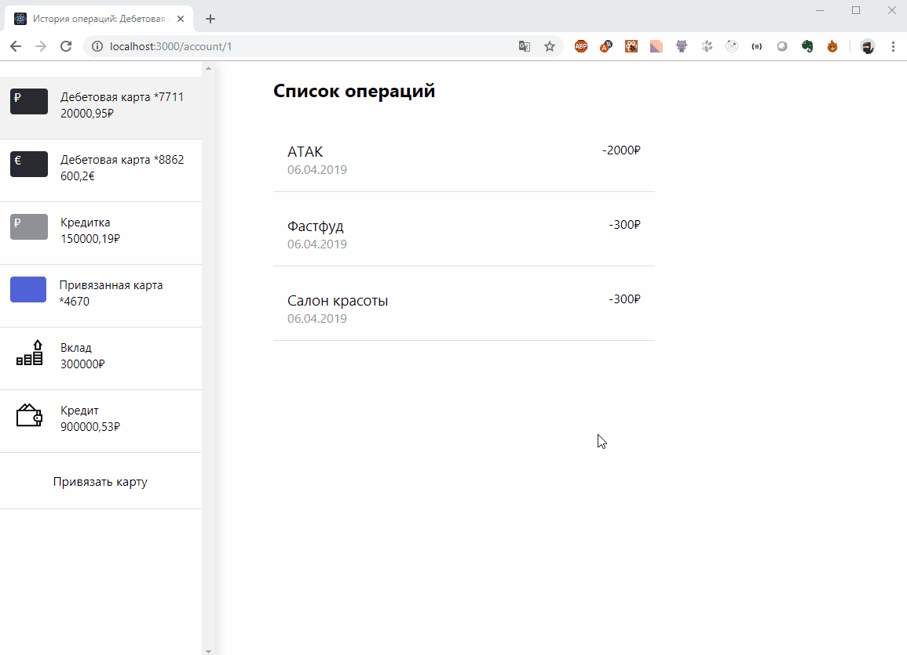
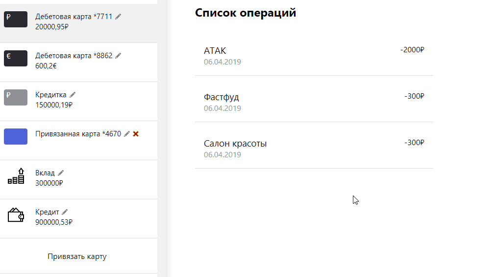

# Интернет банк

Основан на [create-react-app](https://github.com/facebook/create-react-app).

## Запуск
- Установка пакетов: `yarn install`
- Запуск проекта: `yarn run start`
- Запуск в браузере: [http://localhost:3000](http://localhost:3000)

## Функциональность
- Продукты могут быть разными - это дебетовые и кредитные карты, вклады, кредиты, а также привязанные карты сторонних банков.
- Есть форма привязки банковской карты стороннего банка. В форме присутсвует валидация для ввода даты.
- Карты сторонних банков можно удалять.
- У всех карт можно редактировать название.

## Роутинг
1. При переходе на `/actions/add_card` пользователю отображается форму привязки карты стороннего банка.
2. При переходе на `/account/:accountId` на странице представлен список операций по аккаунту пользователя.
3. Если пользователь перешел на страницу, которой нет на сайте, то отображается `статус 404`.

## Пример работы приложения 1

## Пример работы приложения 2

## Пример работы приложения 3

